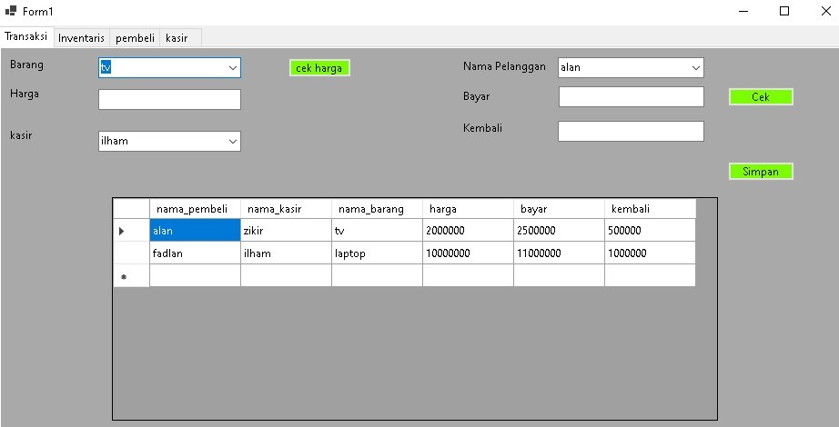

#Transaksi
Pada menu ini user akan memasukan nama barang, harga barang, dan nama kasir. Setelah itu user akan mengecek harga barang yang di beli, kemudian user akan memasukan nama pelanggan dan uang yang di bayarkan. Setelah di cek, jika user memilih memilih menyimpan data pembelian maka data pemebelian tersebut akan langsung di tampilkan pada tabel yang terletak di bawah.

