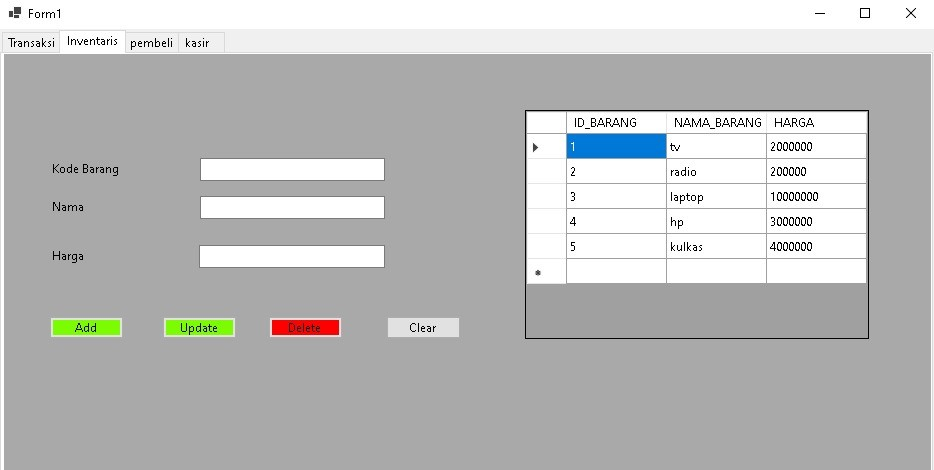
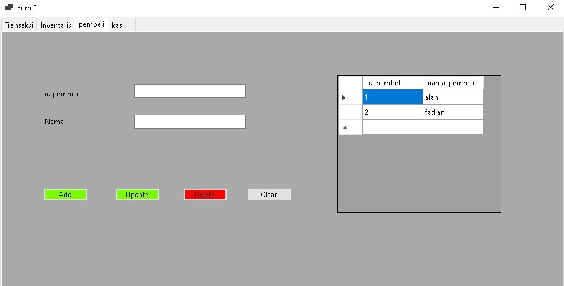
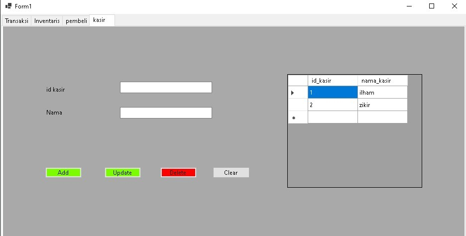

# Transaksi
Pada menu ini user akan memasukan nama barang, harga barang, dan nama kasir. Setelah itu user akan mengecek harga barang yang di beli, kemudian user akan memasukan nama pelanggan dan uang yang di bayarkan. Setelah di cek, jika user memilih memilih menyimpan data pembelian maka data pemebelian tersebut akan langsung di tampilkan pada tabel yang terletak di bawah.

# Inventaris
Menu ini adalah menu yang di gunakan untuk memasukan daftar barang baru, mengupdate barang, ataupun menghapus barang dari database yang nantinya akan di gunakan pada menu transaksi. Data yang dimasukan berupa kode barang, nama barang, serta harga barang ynag nantinya barang yang telah terdaftar akan di tampikan ke dalam tabel.

# Pembeli
Yaitu menu yang di gunakan untuk menambahkan daftar nama pembeli, data yang di masukan pada menu ini adalah id pembeli dan nama pembeli.

# Kasir
Jika sebelumnya adalah menu pembeli maka yang terakhir adalah menu kasir, sama seperti menu pembeli data yang di masukan disini adalah id kasir dan nama kasir.

